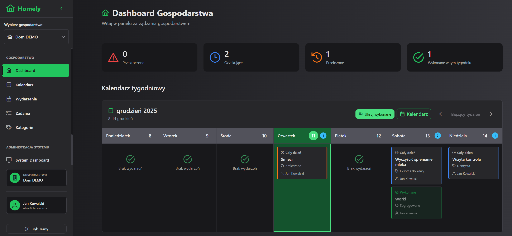

#    Homely

A comprehensive web application for managing household service appointments and family visits, designed to help homeowners efficiently organize and track various home maintenance tasks and family schedules.

<!-- Screenshot aplikacji - dodaj plik do docs/screenshots/ i odkomentuj poniższy kod -->


## Table of Contents

- [Project Description](#project-description)
- [Tech Stack](#tech-stack)
- [Getting Started Locally](#getting-started-locally)
- [Available Scripts](#available-scripts)
- [Project Scope](#project-scope)
- [Project Status](#project-status)
- [License](#license)

## Project Description

Homely is a centralized web system that enables household members to effectively manage service appointments for home appliances and family visits, eliminating the problem of missed appointments and inefficient management of domestic responsibilities.

### Key Features

- **Service Management**: Track technical inspections, waste collection, and medical visits
- **Automated Notifications**: Email reminders to prevent missed appointments
- **Document Storage**: Store invoices, manuals, and warranties in context
- **Multi-user Support**: Clear responsibility assignment among household members
- **Freemium Model**: Basic features free with premium upgrades available

### Target Audience

Homeowners managing household operations who need to organize and monitor various appointments related to home maintenance and family member visits.

## Tech Stack

### Frontend
- **Angular 19** - Modern web framework with standalone components and signals
- **PrimeNG** - Comprehensive UI component library (buttons, dialogs, tables, calendar)
- **TypeScript** - Type-safe JavaScript
- **Playwright** - End-to-end testing framework

### Backend
- **.NET 9** - Robust framework for business logic and API development
- **ASP.NET Core** - RESTful Web API framework
- **Entity Framework Core** - ORM for database access

### Database
- **Supabase** - Open-source PostgreSQL database with built-in authentication
- **PostgreSQL** - Reliable relational database with Row Level Security (RLS)

### Infrastructure & DevOps
- **GitHub Actions** - CI/CD pipeline automation (backend, frontend, database, E2E tests)
- **AWS** - Cloud hosting platform (ECS, CloudFront, ALB, S3)
- **Terraform** - Infrastructure as Code for AWS deployment
- **Docker** - Containerization for E2E testing and deployment

## Getting Started Locally

### Prerequisites

Make sure you have the following installed:
- [Node.js](https://nodejs.org/) (v18 or higher)
- [.NET 9 SDK](https://dotnet.microsoft.com/download/dotnet/9.0)
- [Docker](https://www.docker.com/) (for E2E tests)
- [Supabase CLI](https://supabase.com/docs/guides/cli) (for database management)

### Installation

1. **Clone the repository**
   ```bash
   git clone https://github.com/your-username/homely.git
   cd homely
   ```

2. **Setup Frontend**
   ```bash
   cd frontend
   npm install
   ```

3. **Setup Backend**
   ```bash
   cd backend/HomelyApi
   dotnet restore
   ```

4. **Configure Environment Variables**

   Create `appsettings.Local.json` in `backend/HomelyApi/Homely.API/` with your Supabase credentials:
   ```json
   {
     "Supabase": {
       "Url": "https://your-project.supabase.co",
       "Key": "your-anon-key"
     },
     "Jwt": {
       "Secret": "your-jwt-secret",
       "ValidIssuer": "https://your-project.supabase.co/auth/v1"
     }
   }
   ```

5. **Database Setup**
   ```bash
   cd database
   npm install

   # Link to your Supabase project
   npx supabase link --project-ref <your-project-ref>

   # Apply migrations
   npx supabase db push

   # Configure backend connection in appsettings.Local.json
   ```

### Running the Application

1. **Start the Backend API**
   ```bash
   cd backend/HomelyApi/Homely.API
   dotnet run
   ```

2. **Start the Frontend (in a new terminal)**
   ```bash
   cd frontend
   npm start
   ```

3. **Access the Application**
   - Frontend: `http://localhost:4200`
   - Backend API: `http://localhost:5000` (or `https://localhost:5443`)

## Available Scripts

### Frontend (Angular)
- `npm start` - Start development server (local configuration)
- `npm run start:e2e` - Start development server (E2E configuration)
- `npm run build` - Build for production
- `npm run test` - Run unit tests
- `npm run e2e` - Run end-to-end tests with Playwright
- `npm run e2e:ui` - Run E2E tests in UI mode
- `npm run e2e:full` - Run full E2E test suite with Docker

### Backend (.NET)
- `dotnet run` - Start development server
- `dotnet build` - Build the project
- `dotnet test` - Run unit tests
- `dotnet publish` - Publish for deployment

### Database (Supabase)
- `cd database && npx supabase link` - Link to Supabase project
- `npx supabase migration new <name>` - Create a new migration
- `npx supabase db push` - Apply migrations to database
- `npx supabase db reset` - Reset database (development only)
- `npx supabase status` - Check Supabase project status

### Docker (E2E Testing)
- `cd frontend && npm run e2e:docker:start` - Start E2E test environment
- `npm run e2e:docker:stop` - Stop E2E test environment
- `npm run e2e:docker:clean` - Clean up E2E containers and volumes

## Project Scope

### MVP Features ✅

The first version supports flexible category management:
- **Dynamic Categories** - User-defined categories grouped by types
- **Category Types** - Technical inspections, medical visits, waste collection, and custom types
- **Task Templates** - Reusable task definitions with optional intervals

### Core Functionality (Implemented)
- ✅ User authentication with JWT (login, session management)
- ✅ Multi-household support with role-based access
- ✅ Task template management (create, edit, delete)
- ✅ Event scheduling from task templates
- ✅ Event actions (complete, postpone, cancel)
- ✅ Dashboard with weekly calendar and event list
- ✅ Monthly calendar view
- ✅ Category and category type management
- ✅ System administration for platform managers
- ✅ Responsive web interface with PrimeNG components

### Planned Features (In Progress) 🚧
- User registration with email verification
- Password reset functionality
- Household member invitation and management
- Automatic next event generation on completion
- Freemium limits enforcement (5 tasks, 3 members on free plan)

### Future Enhancements 🚀

Post-MVP planned features:
- Email notification system with reminders
- Document upload and storage
- Premium features (event history, cost reports, analytics)
- Additional categories (plants, insurance, recurring payments, pets)
- Native mobile applications with push notifications
- External calendar integrations (Google Calendar, Outlook)
- OCR document processing
- Predictive maintenance recommendations

### Out of Scope (MVP)

- Native mobile apps (web-responsive only for MVP)
- AI/ML features (OCR, prediction algorithms)
- Social features and community aspects
- Smart home integrations
- Automatic payment processing

## Project Status

🚧 **In Development** - MVP Phase (Active)

### Current Progress

#### ✅ Core Infrastructure
- [x] Project planning and requirements documentation
- [x] Technology stack selection
- [x] Database schema implementation (PostgreSQL via Supabase)
- [x] CI/CD pipeline (GitHub Actions workflows)
- [x] Terraform infrastructure modules for AWS deployment

#### ✅ Backend API (.NET 9)
- [x] Authentication system (JWT-based with Supabase Auth)
- [x] Tasks API - CRUD operations for task templates
- [x] Events API - CRUD + complete, postpone, cancel actions
- [x] Categories & CategoryTypes API - Full management
- [x] Households API - Multi-household support
- [x] Dashboard API - Upcoming events, statistics
- [x] System Admin APIs - User & household management
- [x] Unit and integration tests

#### ✅ Frontend Application (Angular 19 + PrimeNG)
- [x] Authentication (Login with JWT)
- [x] Sidebar navigation with role-based menu sections
- [x] Household Dashboard with:
  - Navigation tiles (Calendar, Events, Tasks, Categories)
  - Interactive weekly calendar view
  - Events list with date range selection
  - Event details dialog with actions
- [x] Tasks management (list, create, edit, delete, create event from task)
- [x] Events management (list, filtering, sorting, pagination)
- [x] Monthly calendar view with day events panel
- [x] Categories management (CRUD for categories and category types)
- [x] Household switcher for multi-household users
- [x] System Dashboard for administrators
- [x] System Users management
- [x] System Households management
- [x] E2E tests with Playwright

#### 🚧 In Progress
- [ ] Event completion with automatic next event generation
- [ ] User registration and email verification
- [ ] Password reset flow
- [ ] Household member management UI

#### 📋 Planned (Post-MVP)
- [ ] Email notification system
- [ ] Document upload and storage
- [ ] Premium features (history, reports, analytics)
- [ ] Production deployment to AWS